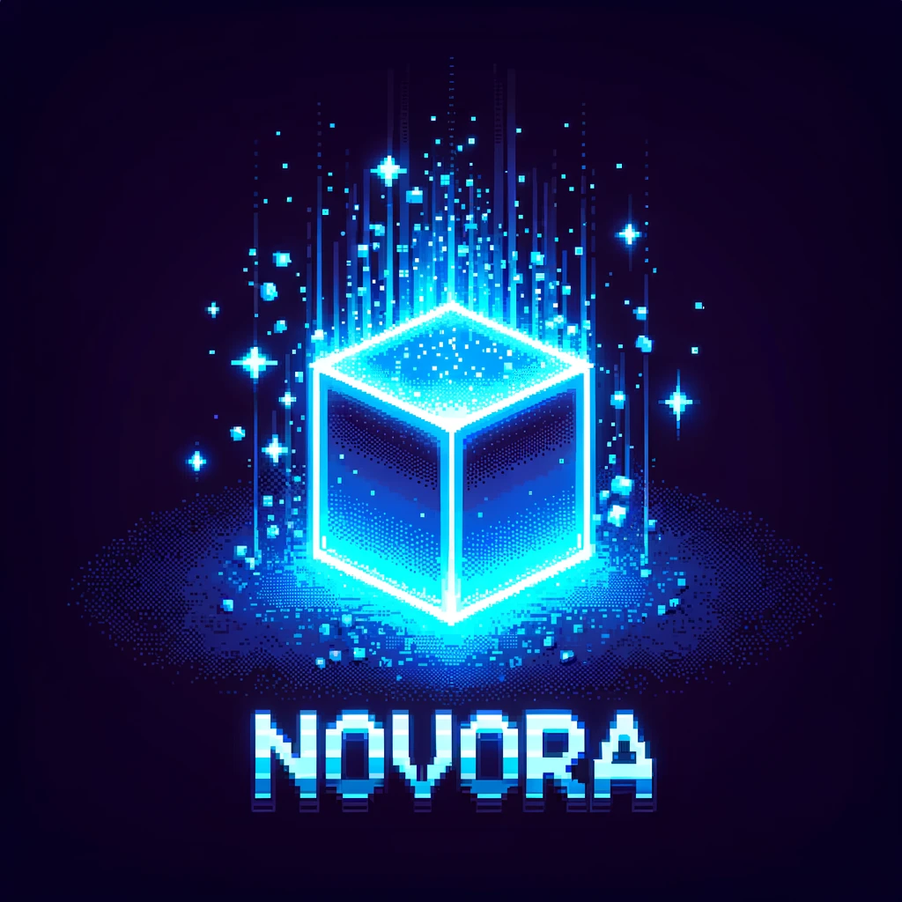
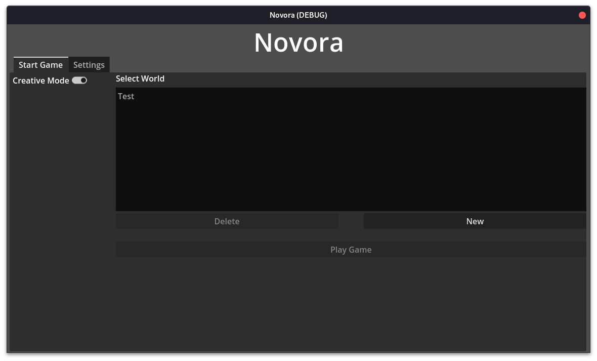
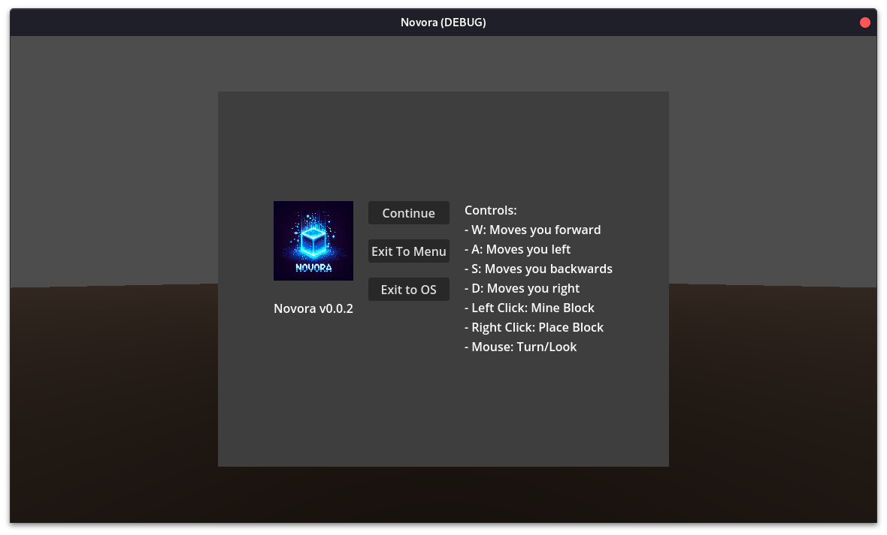

# Voxey 🌍


Voxey is a freedom-respecting voxel game built with the power and flexibility of the Godot engine. Dive in, craft your world, and unleash its infinite modding potential!



## Features

- **Open-World Exploration**: Traverse an expansive voxel universe teeming with possibility.
- **Freedom-First Philosophy**: Proudly free/libre, ensuring that the game remains accessible and modifiable by the community.
- **Extensive Modding**: Utilize the robustness of the Godot engine to create mods that revolutionize gameplay.
- **Dynamic Environments**: From lush forests to barren deserts, experience diverse biomes and ecosystems.
- **Community Driven**: Join a community passionate about creating, sharing, and collaborating.

## Screenshots

### Main Menu


### Create World Menu


### Pause Menu


## Getting Started

### Prerequisites

- Godot 4.1 or higher

### Installation

1. Clone the repository:
```sh
git clone https://github.com/Hacknique/Voxey
```

2. Open the project in Godot.
3. Hit "Play" to start your adventure!

## Modding

WIP: No Modding API Yet.
Voxey's architecture is designed for modding. Refer to our [Modding Guide](./docs/MODDING.md) for detailed instructions and tutorials on getting started with creating mods.

## Contribution

Contributions are what make the open-source community such an inspiring place to learn, inspire, and create. We welcome any and all contributions! Refer to our [Contribution Guide](./docs/CONTRIBUTING.md) for more information.

## License
Each part of this project is licensed under specific terms. In cases where a file doesn't have a license notice or is not otherwise specified, it falls under the Fallback License. Below are the licensing details:

+ **Code**: The code is licensed under the terms provided in the [Code License file](LICENSE).
+ **Assets**: The assets are covered by the license specified in the [Assets License file](assets/LICENSE).
+ **Documentation**: The documentation is under the license mentioned in the [Documentation License file](docs/LICENSE).
+ **Fallback License**: For files without a license notice or otherwise specified license, refer to the [Fallback License file](./LICENSE).

## Community

Join Our Matrix Space, Discord Server or Facebook Group.

- **[Matrix](https://matrix.to/#/#voxey:james-clarke.ynh.fr)**
- **[Discord](https://discord.gg/Znwk5cARQm)**
- **[Facebook Messenger](https://m.me/ch/AbYLuYLZzZktEhao/)**

## Acknowledgements

- [Godot Engine](https://godotengine.org/)
- And all our wonderful contributors and community members!

Join us on our journey to make Voxey the best free voxel game out there!
